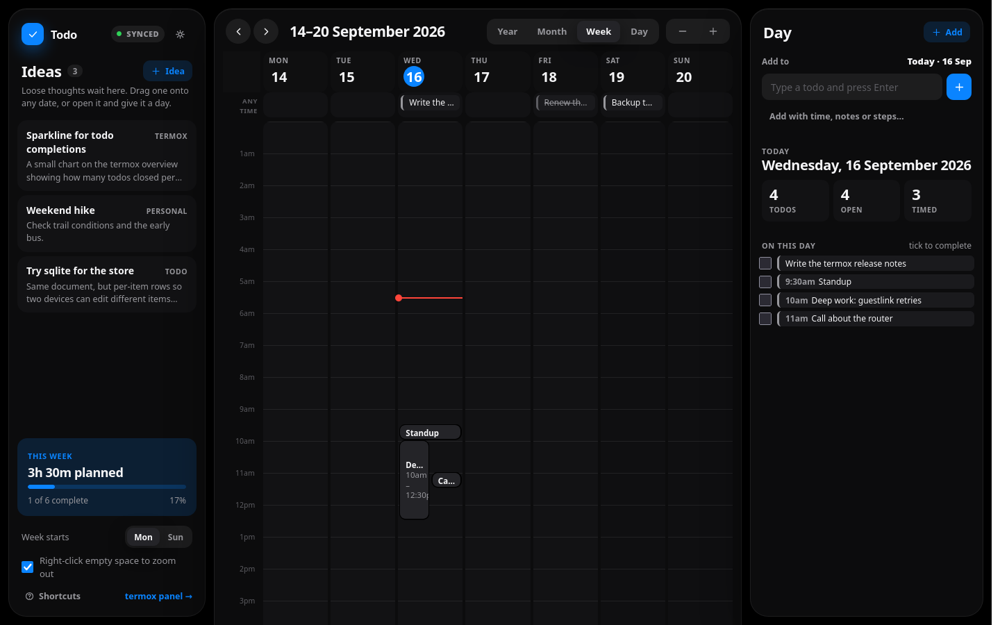

# termox

A control panel for everything running on a phone. It runs **in Termux on the
phone itself** and answers on the LAN, so a browser anywhere in the house shows
what the device, its virtual machines and its model servers are doing.

Built for a Galaxy S20 (Snapdragon 865) running AdGuard Home, Immich and two
local LLM servers, all natively -- no VM, no container, no root.

```
browser  →  phone:8080   termox        (Termux, native, stdlib only)
                ├─ /proc + /sys        the phone, incl. Adreno GPU
                ├─ /proc/<pid>         each qemu process
                ├─ :8081 /metrics      model server on the CPU
                ├─ :8082 /metrics      model server on the GPU
                ├─ :3000 /control      AdGuard Home
                ├─ :2283 /api/server   Immich, with PostgreSQL and Valkey behind it
                ├─ ssh 127.0.0.1:2222  inside each guest (when one exists)
                └─ /todo/              a todo list, one JSON file beside the registry
```

Stdlib only on both ends. No pip, no npm, no build step, and **nothing
installed inside the guests**.

---

## What this project found

Most of the work here was measurement, and several results contradicted the
obvious assumption. They are the reason the code looks the way it does.

### The thread count is worth ~200x

On a Snapdragon 865, `llama.cpp` generation throughput against thread count
(llama-bench, Qwen2.5-0.5B Q4_0, tg32):

| threads | prompt | generation |
|---|---|---|
| 2 | 29.4 | 20.7 tok/s |
| 3 | 44.0 | 29.4 |
| **4** | **58.1** | **39.2** |
| 5 | 59.8 | 25.7 |
| 6 | 60.2 | 23.8 |
| 8 (llama-bench default) | 9.6 | **0.2** |

The 865 is 4 big cores plus 4 little ones. A fifth thread lands on an
efficiency core that every synchronisation barrier then waits for. **Never let
the thread count default.**

That holds for generation only. Prompts are batches, and batches do gain from
the little cores: on Qwen3.5-4B, seven threads on cores 1-7 read prompts 15%
faster than four (6.49 against 5.64 tok/s) while generating 4% slower.
llama-server takes the two counts separately, so `llm.sh` runs `-t 4 -tb 7`.
Small models lose the most from a slow core on each step: seven threads take a
third off the 0.8B's generation, and an eighth, on the core the other services
share, still takes it to 0.19 tok/s.

### The GPU works, and is the slower option

The Adreno 650 can be made to run inference from unrooted Termux, which took
three non-obvious fixes (below). It reaches 10.8 tok/s — against **39.2 on four
CPU threads**. It is also *numerically wrong* for some models: Qwen3.5 emits
degenerate loops at temperature 0 on the OpenCL backend while the identical
GGUF answers correctly on the CPU. Qwen2.5 is fine on both, which is what
disguised the fault as broken model support at first.

Getting there needed:

- `LD_LIBRARY_PATH=$PREFIX/opt/vendor/lib` — ocl-icd cannot drive Qualcomm's
  driver, which is a full implementation rather than an ICD vendor library, so
  the loader reports zero platforms. That directory holds only `libOpenCL.so`,
  which is why it is safe first on the path; `/vendor/lib64` would hijack
  libc++ and break every Termux binary.
- A tiny `LD_PRELOAD` shim (`phone/shim.c`) supplying
  `clCreateBufferWithProperties`, an OpenCL 3.0 entry point the 2021 Adreno
  driver never shipped. Without it `libggml-opencl.so` will not even `dlopen`.
  Instrumenting the shim showed ggml never actually *calls* it — it exists
  purely to satisfy symbol resolution.
- `-fa off` — the flash-attention kernels assume Adreno 7xx work-group geometry
  and abort with `CL_INVALID_WORK_GROUP_SIZE` on a 650.

### Android hides more than you expect

On a Samsung build (Knox tightens SELinux well past stock), an ordinary app is
**denied `/proc/stat`, `/proc/uptime`, `/proc/loadavg`, `/proc/net/dev` and
`/sys/class/net`**. Every reading here therefore has a fallback, and where
there is none the panel says why instead of showing a zero that reads as an
idle system.

| Reading | How termox gets it |
|---|---|
| Per-core CPU load | **`/sys/.../cpuidle/state*/time`** — busy time derived from idle residency, since `/proc/stat` is off limits |
| Core frequencies, clusters | `/sys/devices/system/cpu/...` |
| System uptime | derived from this process's own `/proc/self/stat` start jiffies |
| RAM, swap | `/proc/meminfo` |
| Storage | `statvfs`; read-only volumes skipped |
| Thermal zones | `/sys/class/thermal` |
| GPU load and clock | `gpu_busy_percentage` and `clock_mhz` — readable, unlike the root-only `gpubusy`/`gpuclk` that the obvious guess uses |
| Per-VM CPU, memory, uptime | `/proc/<pid>/stat` — own processes stay visible |
| Battery | Termux:API package **plus** the companion app |
| **Load average** | **not available** |
| **Host network throughput** | **not available** — the guest's own interfaces still are |

### The kernel hides the cores it has parked

Two versions of `tune.sh` slowed the model server down, and both fell into the
same trap. Qualcomm's `core_ctl` **parks big cores that have gone idle** — here
core 4 and the prime core 7 — and this kernel leaves parked cores out of what
`sched_getaffinity()` reports, although `Cpus_allowed` in `/proc` still lists
them. That is what "the permitted core set changes between two calls" was.
They wake as soon as there is load, unless a mask built from that report
keeps a process off them:

| Qwen3.5-4B, 4 threads | prompt | generation |
|---|---|---|
| free to use all four big cores | 5.62 | 4.24 tok/s |
| mask copied from an idle report | 3.55 | 2.62 |

The first version ranked the reported cores by `cpuinfo_max_freq` and
"halved" throughput; ranked from that set, the fastest four are two big cores
and two little ones. It blamed the frequency caps it saw, which are real but
come from heat and cap a whole cluster (below). The next version copied the
report onto llama-server outright. `tune.sh` now builds masks from the core
count: **core 0 for everything else, cores 1-7 for the CPU model server** and
1-3 for the GPU server's host threads, every thread, re-applied every 30
seconds.

### The big cores throttle at 40 C skin

Samsung's overheat protection caps both big clusters at **1747 MHz** (of 2419
and 2841) once the skin sensor nears 40 C (`sys.siop.level` above 0), and lifts
the cap about a minute after it cools. From 37 C, one minute of full load
trips it, and screen mirroring's software encoder is enough to hold it there.
It costs the 4B about 30% of its prompt speed and 16% of its generation. Screen
state and Android's fixed-performance mode do not move it, and the knob behind
it (`/sys/power/cpufreq_max_limit`) is closed even to `adb shell`. Cooling is
the only lever left.

### AdGuard Home runs natively, but only just

The phone used to run a QEMU VM whose entire job was hosting one AdGuard
container. Removing it freed **4.6 GB of RAM** and the 183-300% of a core that
TCG emulation was burning; AdGuard itself uses **87 MB**. Three obstacles stood
in the way, and the order they appeared in matters:

- **The official ARM64 binary crashes instantly.** `SIGSYS: bad system call` on
  syscall `0x1b7` = `faccessat2`, reached through `os/exec.LookPath`. Android's
  seccomp filter kills the process rather than returning an error, which is why
  stock Go binaries so often die on Termux.
- **Termux's own Go toolchain fixes that** -- it targets `android/arm64`, not
  `linux/arm64`. Compiling the exact failing call proved it before committing to
  a full build. The web UI does not need building: AdGuard publishes
  `AdGuardHome_frontend.tar.gz` alongside the binaries, which drops into
  `build/static` for `go:embed` to pick up. Building it on-device instead means
  fighting a `@types/react` mismatch that upstream's own `package.json` cannot
  resolve (it omits `typescript` entirely).
- **`bind_hosts: 0.0.0.0` is fatal**, and this one is not obvious. Expanding a
  wildcard bind makes AdGuard enumerate interfaces via netlink, which Android
  denies to apps -- `route ip+net: netlinkrib: permission denied`. Go's
  `net.Interfaces()` returns nothing here for the same reason, so it cannot be
  fixed in AdGuard. Binding *literal* addresses skips the enumeration entirely,
  which is why `phone/adguard.sh` resolves the current LAN address itself and
  writes it into the config on every start. The web listener needs the same
  treatment, and its `address:` key is usually absent from the config, so it
  has to be inserted rather than replaced.

Port 53 still cannot be bound without root, so DNS answers on **5300** -- the
same port the VM used to forward, so no client needed reconfiguring.

### Immich runs natively, once three things are built by hand

Immich is a Node server, PostgreSQL with a vector index, a Redis-shaped queue
and an optional Python model server. All but the last go on the phone;
`phone/immich/install.sh` does it, and each of these cost a failed run:

- **Termux's `postgresql` package skips two contribs Immich needs.** It builds
  sixteen of them and leaves out `cube` and `earthdistance`, which map search
  depends on. They are built with PGXS from the PostgreSQL source matching the
  installed version -- and since 17, release tarballs no longer ship the
  generated parser, so `bison` and `flex` are part of the install.
- **PGXS does not link libm, and bionic keeps the maths there.** The first
  pgvector built cleanly and then killed `CREATE EXTENSION` with `cannot
  locate symbol "acos"`. Every extension is built with `SHLIB_LINK=-lm`.
- **`pkg install ffmpeg` can leave ffmpeg unable to start.** Its libplacebo
  wants a newer `libc++` than a phone that has not upgraded lately carries,
  the post-install hook fails on `CANNOT LINK EXECUTABLE`, and dpkg aborts
  the whole install with the package half-configured. Lifting `libc++` alone
  fixes it; a full `pkg upgrade` would also replace the model servers'
  llama.cpp, which the notes above say to retest after.
- **The vector index is pgvector, not VectorChord.** Immich recommends
  VectorChord, a Rust extension built with pgrx: a multi-hour build on a
  phone. It still accepts pgvector (any 0.5 to 0.x) when
  `DB_VECTOR_EXTENSION=pgvector` says so, and pgvector is one `make` against
  `pg_config`, with `-march=native` dropped because Android's clang refuses it.
- **Two native modules have to be compiled here, against bionic.** `sharp` and
  `bcrypt` from the official image are linked against glibc and will not load.
  Dependencies are installed and pruned the way the official Dockerfile does
  it, with one change: the image installs with prebuilt sharp and switches to
  the system libvips only when pruning, and there is no prebuilt sharp for
  `android-arm64`, so `SHARP_FORCE_GLOBAL_LIBVIPS` is set for both steps.
  Termux's libvips already carries HEIF, JPEG XL and raw through ImageMagick.
  `node-gyp` is pointed at Termux's patched Node headers with
  `npm_config_nodedir` rather than letting it download upstream's.
- **The TypeScript compiler will not run on the phone.** TypeScript 7 is a Go
  binary shipped per platform, and there is none for `android-arm64`. The
  `linux-arm64` one, renamed into place, dies with `SIGSYS` on `fanotify_init`
  during package initialisation -- the same seccomp kill that took out the
  stock AdGuard binary on `faccessat2`, and it fires before a single line of
  the compiler runs, so there is nothing to configure around. The compiled
  JavaScript is portable, so it comes out of the official image.
- **So does everything else that is portable.** The core workflow plugin is
  WebAssembly produced by `extism-js`, which has no Android build either.
  `phone/immich/portable.sh` pulls the compiled server, the plugin, the web
  app and the geodata out of the image on any machine with Docker: 38 MB. The
  phone installs the dependencies, compiles the two native modules, and
  prunes the result into the tree it runs.
- **Valkey refuses to start while the phone is busy, and only then.** On
  arm64 it tests at startup for the kernel's MADV_FREE-after-fork bug, and
  this Samsung kernel has it -- but the test only comes back positive while
  the kernel is reclaiming memory. So Valkey started on a quiet phone, and
  refused every restart once a backup upload from the app had the phone
  under pressure, taking Immich's queue with it. It now runs with snapshots
  and the append log off, so it never forks and the bug cannot reach it, and
  the check is switched off with `--ignore-warnings ARM64-COW-BUG`. The
  launcher also waits for Valkey to answer before starting the server,
  because `--daemonize` returns before the server has decided to live.
- **Android counts processes, and Immich pushed the phone over.** Android 12+
  caps an app's background processes at 32 device-wide and kills processes,
  not apps, past it or when they burn CPU for long: the phantom process
  killer. PostgreSQL's helpers, Immich's two processes with up to ten
  connections each, and exiftool workers took a phone that had run fifteen
  processes for thirteen days to well past the limit, and the first backup
  from the app killed Termux four times in an afternoon, a different subset
  of processes surviving each time. Android's log names it: `Killing
  PhantomProcessRecord {sshd/u0a323}: Trimming phantom processes`, 25 of
  them in one second. The fix is an adb setting
  (`settings_enable_monitor_phantom_procs false`); PostgreSQL is also run
  without its I/O workers and replication launcher, and Immich's job
  concurrency kept low, so fewer processes exist to count.
- **Immich renames its own processes.** `main.ts` sets `process.title`, which
  on Linux overwrites the argv block that `/proc/<pid>/cmdline` is read from,
  so the server shows up as `immich` and the API it forks as `immich-api`, with
  no `node` and no script path left. The panel matches those titles, and folds
  the child's memory and processor time into the parent's, because the parent
  runs the jobs and the child serves the browser and neither alone is what
  Immich costs.
- **Its telemetry defaults would land on the model servers.** Prometheus is
  off unless asked for, but its default ports are 8081 and 8082. Moved to
  2284 and 2285 so a future toggle cannot collide.
- **No machine learning on the phone.** onnxruntime has no wheels for bionic.
  Uploads, albums, the map and sharing all work without it; smart search and
  faces need the official model server on another machine, which one line in
  the environment file points at.

### Smaller findings worth keeping

- **Context is allocated per slot.** llama-server gives each parallel slot the
  full `-c`, so `-c 32768` alone tries to allocate several. Paired with
  `--parallel 1`, 32k context costs about 0.2 GB. Verified with a 7,015-token
  prompt at 32.9 tok/s.
- **A 0.8B model cannot close its own thinking block, and the trivial prompts
  are the ones that run away.** With reasoning on and nothing bounding it,
  "name three colours" and "write one sentence about rain" both enumerated
  alternatives until they hit the context limit and returned *empty* content,
  while "what is 17 * 23?" terminated on its own in 331 tokens. The model loops
  when it has nothing to reason about, so a smoke test built from arithmetic
  misses the bug entirely. 7 of 12 unbounded runs came back empty.

  `--reasoning-budget` is the fix, and it is the only thing that worked. It
  forces the closing tag as a sampler, not through the template, so it fires
  however thinking was enabled: across 114 budgeted runs, zero empty replies,
  and it held through hostile "consider at least 25 alternatives" prompts, four
  languages, five-turn histories and an injected unclosed `<think>` block.
  `--reasoning-budget-message` is required alongside it, and the *two leading
  newlines* matter more than the wording — the budget cuts mid-token, and
  without them one run was severed inside "6150" and another leaked a literal
  `</think>` into the answer.

  Four things that look like fixes and are not, all measured: `--reasoning-effort`
  is a no-op (`/props` reports `supports_reasoning_effort: false`); `-n` never
  registers in this build, so `-c` is the only ceiling a client cannot raise;
  `--reasoning off` is not a safe default, because the advertised opt-in path
  reproduces the runaway unguarded *and* answers 17\*23 as 491 where budgeted
  reasoning answers 391; and Qwen's own published thinking-mode sampling was the
  worst configuration tested, 0 for 3, all empty — it stops the repetition and
  the model explores forever instead. Repeat-penalty and DRY made it worse still.
  Stock sampling, unchanged, plus a budget.
- **llama.cpp resets its `/metrics` per-second gauges on scrape**, so anything
  polling them frequently reads zero forever. Worse, the underlying counters
  only advance when a request *completes*, so a naive delta reads zero during
  generation too. The rate shown is the tokens a finished request added divided
  by the seconds it added — the true rate of that request — carried forward
  while the next one runs.
- **Docker inside an emulated guest is brutally slow** — `docker ps` costs 18
  seconds and `docker stats` 22, because the Go CLI has to start under TCG. The
  guest probe therefore never waits on Docker: it reads a cache file inside the
  guest and kicks off a detached refresh when that goes stale.
- **Installing a Termux add-on force-stops Termux**, taking down every tmux
  session with it — including the VM and its DNS. The boot script doubles as
  the recovery script.

---

## Machines find themselves

Nothing needs registering. termox walks `/proc` for `qemu-system-*` processes
and reads their command line, so a VM started by hand or from a tmux session
simply appears — cores, memory, disks and port forwards parsed out of the
arguments, relative disk paths resolved through the process's own working
directory, and qcow2 virtual sizes read from the image header.

What it learns is written to `~/.config/termox/registry.json`, which is what
lets a machine keep its place in the list after it stops rather than vanishing.

## Reading inside a guest

Guest statistics are collected **over SSH with nothing installed in the VM** —
one multiplexed connection runs a small shell probe that cats `/proc` and asks
Docker for its containers. This works on a stock Alpine image with no Python in
it. A machine is wired up automatically when it forwards a host port to guest
port 22.

```sh
python3 -m termox setup-guest
```

That creates a key and prints the one line to paste inside each guest.

---

## Layout

```
termox/            the dashboard package (stdlib only)
  host.py          Android host readers, with the fallbacks above
  vms.py           QEMU discovery and the persistent machine registry
  guestlink.py     agentless in-guest collection over SSH
  services.py      model servers and DNS: process facts, metrics, probes
  control.py       start / stop / restart as jobs with running commentary
  server.py        HTTP server and the sampler threads
  todo.py          the Todo app's store: one document, merged on conflict
  static/          the UI: hand-built SVG charts, no dependencies
  static/todo/     the Todo app, vendored from the Todo project
phone/             what runs on the phone outside the dashboard
  adguard.sh       AdGuard Home, with the Android workarounds it needs
  llm.sh           CPU model server, with the measurements that justify it
  llm-use.sh       `llm-use 4b`: switch the CPU server's model (also in the panel)
  llm-gpu.sh       GPU model server on the Adreno
  tune.sh          core 0 for the services, cores 1-7 for the model servers
  vm.sh            the Alpine VM, kept for Docker work
  immich.sh        Immich, bringing PostgreSQL and Valkey up alongside it
  immich/          how Immich gets there: install.sh on the phone, portable.sh
                   on a machine with Docker for the pieces the phone cannot build
  shim.c           the OpenCL 3.0 shim
  start-vm.sh      the Termux:Boot script that starts everything
docs/OPERATIONS.md the full operational guide
legacy/            StackScope, the single-VM dashboard this replaced
```

## Install

```sh
pkg install python openssh
mkdir -p ~/termox
# copy the termox/ package folder to ~/termox/
cd ~/termox && python3 -m termox
```

Open `http://<phone-ip>:8080` from any machine on the network. See
[docs/OPERATIONS.md](docs/OPERATIONS.md) for the model servers, the boot
script, and every environment variable.

## Security

The dashboard binds `0.0.0.0:8080` with **no authentication** — keep it on the
LAN or behind Tailscale. Set `TERMOX_TOKEN` to require a token. The model
servers are equally open.

## Todo

The panel also hosts a todo list, at `http://<phone-ip>:8080/todo/`. Ideas
sit on the left, one calendar in the middle zooms from a year to a day, and
the selected todo is edited on the right. Drag an idea onto a date to
schedule it, drag a todo to move it, and add a time only when one matters.
Every date gets an automatic tone shared by everything on it; nobody picks
colours.

It is the same stack as the panel: stdlib Python and a page with no build
step. The list is one JSON document at `~/.config/termox/todo.json`, read
into memory once and rewritten atomically on every save, so it is shared by
every device on the network and backs up with a single copy. Each browser
keeps a copy too, so the page opens instantly and keeps working when the
phone is out of reach. When two devices edit at once the server merges by
item, newest write wins, and tombstones make sure a deletion on one device
is not undone by a stale copy on another. It is deliberately not in Immich's
PostgreSQL: that database comes and goes with Immich's launcher, and the
phone has no Python driver for it.

The rail shows what is due without opening the app, and the overview has a
row of tiles for it. The app is developed in its own project and vendored
here as `termox/todo.py` and `termox/static/todo/`.

## The look

The panel is built on **Modernist**, a design system from a Claude Design
project: zero-radius surfaces, 2px dividers, Archivo throughout, one orange
accent held back for alarms and primary actions, and a set of reading hues
(blue, violet, teal, red, green) so a chart's identity comes from its subject
rather than from rank. `termox/static/ds.css` is that system vendored, changed
in exactly one way: the webfont is self-hosted, because the panel is served
off a phone that may have no route to the internet and a fallback to system-ui
would change the character of the type.

Both grounds ship. The dark one reverses the neutral and accent ramps on their
shared lightness scale so every step keeps its weight, and `?theme=light`
carries a choice in a link. Anything filled with the accent -- the attention
band, primary buttons, the selected window -- carries white type in either
theme, so an orange surface reads the same whichever ground is under it.

The Todo app keeps its own look, the one its build spec asks for: flat black,
Apple blue as the single action colour, rounded glass panels. It is a
different kind of surface from a control panel, and it reads as one.

The mark is an SVG so it stays sharp at the 24px it renders in the header and
at favicon size, and it takes its ink from a CSS variable so the same file
works on either ground. The one photograph on the panel is the device itself,
desaturated to the system's photo treatment: [Galaxy S20 by GadgetsGuy][photo],
CC BY 4.0, vendored so the panel still draws with no route to the internet.

[photo]: https://commons.wikimedia.org/wiki/File:Galaxy_S20_(cropped).png

## Screenshots

The sidebar groups everything into **Host**, **Machines**, **Services** and
**Apps**, and each gets its own page. Any page can be linked to directly with
`?view=<key>`.

**Todo.** A week, with an idea inbox on the left and the selected day on the
right. Overlapping timed todos share the column; untimed ones stack above it.



**Everything.** The default page: what wants attention, the readings across a
window you pick, every machine and service with its controls, and where each
one runs.


**Light.** The same page on the system's paper ground.


The overview ends with **What talks to what** and **Where things run** — the
architecture drawn from the ports actually configured, and every tracked app
with the binary and working directory it was really started from, read from
`/proc` rather than inferred from the launchers.

**A model server.** Throughput, processor and graphics trends, the runtime it
actually got, the endpoints to point a client at, the launcher's own output,
and a box that sends one real request so the panel can show what it measured.


**DNS.** Whether the resolver is answering, on which port, and where the binary
lives.


**Narrow.** Below 900px the rail unpins and the whole panel becomes one column,
so the phone serving all of this can also be the thing reading it.


## Starting and stopping things

Every managed thing is a tmux session running a launcher script, so the panel
can start, stop and restart machines and services. Actions are **jobs**, not
blocking requests, because a model server takes half a minute to load weights
and a VM takes two: each action reports what it is doing while it does it
("asking the guest to power off", "waiting for a clean shutdown", "booting the
guest"), and a restart tracks its own phase so it stops saying "stopping" once
it starts.

Two details matter more than they look:

- **A TCP connect does not mean a VM is ready.** QEMU accepts on its forwarded
  ports the moment it starts, long before the guest boots, so a connect
  reported success in one second. Readiness for a machine comes from reading
  sshd's greeting instead.
- **A failed start says why.** The launcher's output is captured, so when
  QEMU refused to start because AdGuard had taken port 3000, the panel showed
  `Could not set up host forwarding rule` rather than timing out silently.

Transitional state is inferred as well as tracked: a process that is up but
not yet answering on its port reads as *starting* even if it was launched from
a terminal rather than from here, and the buttons disable accordingly.

**The control endpoints are as open as the rest of the panel.** Anyone on the
network can stop your DNS unless `TERMOX_TOKEN` is set, and the host page says
so plainly until it is.

## Status

Reading and lifecycle control work. Creating machines from scratch is the
remaining piece; the registry underneath is built for it, and machines already
report whether they expose a QMP socket, which is the prerequisite.
