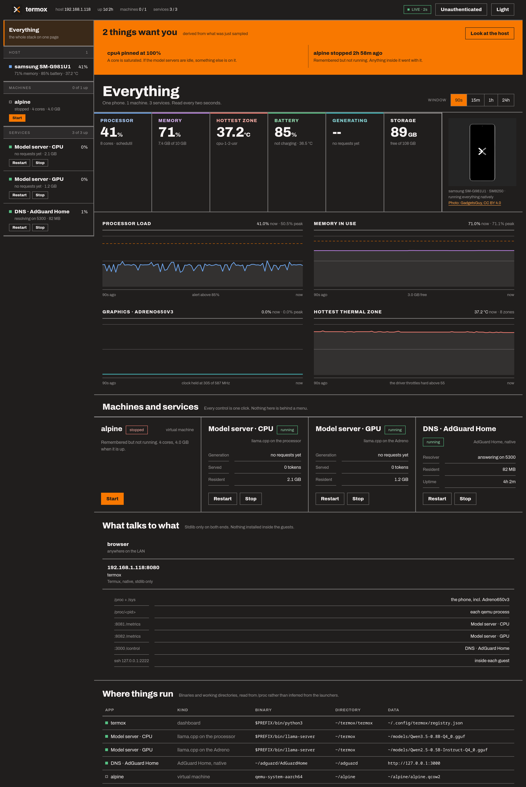
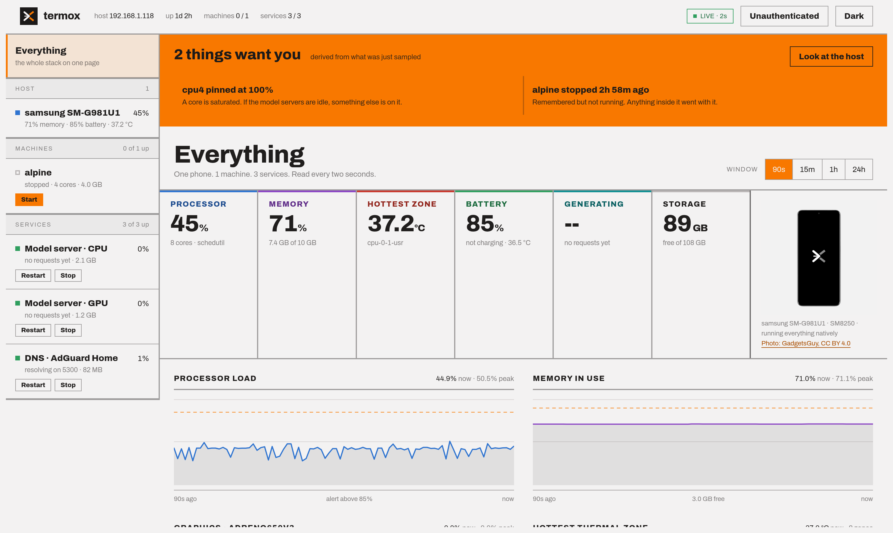
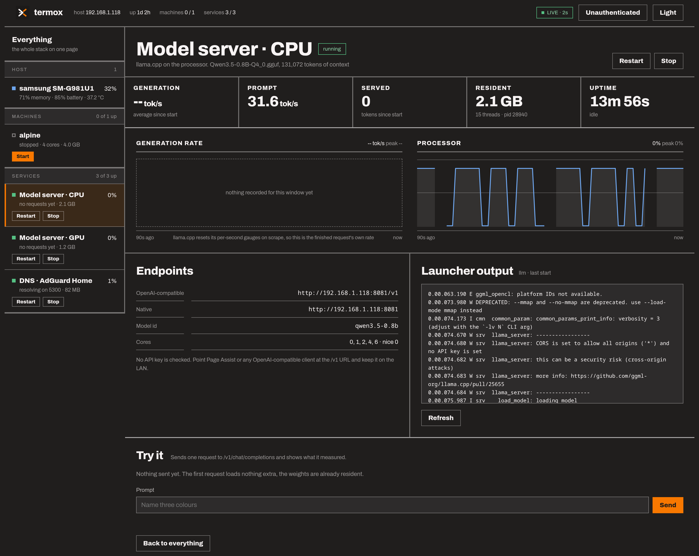
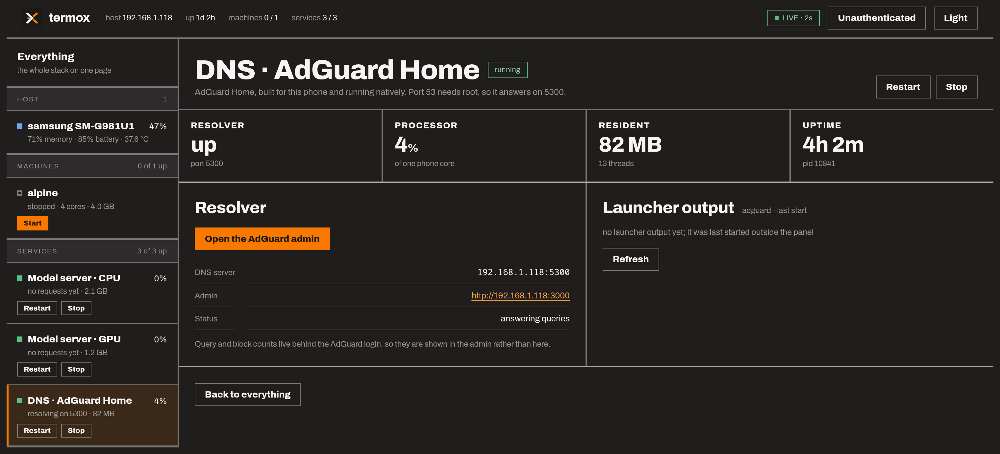
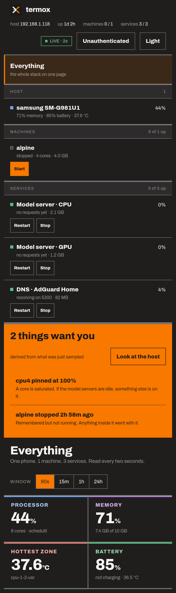

# termox

A control panel for everything running on a phone. It runs **in Termux on the
phone itself** and answers on the LAN, so a browser anywhere in the house shows
what the device, its virtual machines and its model servers are doing.

Built for a Galaxy S20 (Snapdragon 865) running AdGuard Home and two local LLM
servers, all natively -- no VM, no container, no root.

```
browser  →  phone:8080   termox        (Termux, native, stdlib only)
                ├─ /proc + /sys        the phone, incl. Adreno GPU
                ├─ /proc/<pid>         each qemu process
                ├─ :8081 /metrics      model server on the CPU
                ├─ :8082 /metrics      model server on the GPU
                ├─ :3000 /control      AdGuard Home
                └─ ssh 127.0.0.1:2222  inside each guest (when one exists)
```

Stdlib only on both ends. No pip, no npm, no build step, and **nothing
installed inside the guests**.

---

## What this project found

Most of the work here was measurement, and several results contradicted the
obvious assumption. They are the reason the code looks the way it does.

### The thread count is worth ~200x

On a Snapdragon 865, `llama.cpp` generation throughput against thread count
(llama-bench, Qwen2.5-0.5B Q4_0, tg32):

| threads | prompt | generation |
|---|---|---|
| 2 | 29.4 | 20.7 tok/s |
| 3 | 44.0 | 29.4 |
| **4** | **58.1** | **39.2** |
| 5 | 59.8 | 25.7 |
| 6 | 60.2 | 23.8 |
| 8 (llama-bench default) | 9.6 | **0.2** |

The 865 is 4 big cores plus 4 little ones. A fifth thread lands on an
efficiency core that every synchronisation barrier then waits for. **Never let
the thread count default.**

### The GPU works, and is the slower option

The Adreno 650 can be made to run inference from unrooted Termux, which took
three non-obvious fixes (below). It reaches 10.8 tok/s — against **39.2 on four
CPU threads**. It is also *numerically wrong* for some models: Qwen3.5 emits
degenerate loops at temperature 0 on the OpenCL backend while the identical
GGUF answers correctly on the CPU. Qwen2.5 is fine on both, which is what
disguised the fault as broken model support at first.

Getting there needed:

- `LD_LIBRARY_PATH=$PREFIX/opt/vendor/lib` — ocl-icd cannot drive Qualcomm's
  driver, which is a full implementation rather than an ICD vendor library, so
  the loader reports zero platforms. That directory holds only `libOpenCL.so`,
  which is why it is safe first on the path; `/vendor/lib64` would hijack
  libc++ and break every Termux binary.
- A tiny `LD_PRELOAD` shim (`phone/shim.c`) supplying
  `clCreateBufferWithProperties`, an OpenCL 3.0 entry point the 2021 Adreno
  driver never shipped. Without it `libggml-opencl.so` will not even `dlopen`.
  Instrumenting the shim showed ggml never actually *calls* it — it exists
  purely to satisfy symbol resolution.
- `-fa off` — the flash-attention kernels assume Adreno 7xx work-group geometry
  and abort with `CL_INVALID_WORK_GROUP_SIZE` on a 650.

### Android hides more than you expect

On a Samsung build (Knox tightens SELinux well past stock), an ordinary app is
**denied `/proc/stat`, `/proc/uptime`, `/proc/loadavg`, `/proc/net/dev` and
`/sys/class/net`**. Every reading here therefore has a fallback, and where
there is none the panel says why instead of showing a zero that reads as an
idle system.

| Reading | How termox gets it |
|---|---|
| Per-core CPU load | **`/sys/.../cpuidle/state*/time`** — busy time derived from idle residency, since `/proc/stat` is off limits |
| Core frequencies, clusters | `/sys/devices/system/cpu/...` |
| System uptime | derived from this process's own `/proc/self/stat` start jiffies |
| RAM, swap | `/proc/meminfo` |
| Storage | `statvfs`; read-only volumes skipped |
| Thermal zones | `/sys/class/thermal` |
| GPU load and clock | `gpu_busy_percentage` and `clock_mhz` — readable, unlike the root-only `gpubusy`/`gpuclk` that the obvious guess uses |
| Per-VM CPU, memory, uptime | `/proc/<pid>/stat` — own processes stay visible |
| Battery | Termux:API package **plus** the companion app |
| **Load average** | **not available** |
| **Host network throughput** | **not available** — the guest's own interfaces still are |

### CPU pinning made things worse

An earlier version of `tune.sh` pinned the model server to the "fast" cores,
ranked by `cpuinfo_max_freq`. That **halved** throughput — 8.7 tok/s pinned
against 19.5 unpinned — because Android inverts the ranking for background
apps:

```
cpu7  prime,  2841 MHz max  ->  capped at 1747, running  845 MHz
cpu4  perf,   2419 MHz max  ->  capped at 1747, running 1382 MHz
cpu0  little, 1804 MHz max  ->  uncapped,       running 1612 MHz
```

Hardware maximum frequency is the wrong metric: pinning to the "fastest" cores
pins to the *most throttled* ones. The permitted core set also moves — it was
observed changing between two consecutive calls of the same script. The model
servers are therefore left unpinned; only QEMU is confined and niced.

### AdGuard Home runs natively, but only just

The phone used to run a QEMU VM whose entire job was hosting one AdGuard
container. Removing it freed **4.6 GB of RAM** and the 183-300% of a core that
TCG emulation was burning; AdGuard itself uses **87 MB**. Three obstacles stood
in the way, and the order they appeared in matters:

- **The official ARM64 binary crashes instantly.** `SIGSYS: bad system call` on
  syscall `0x1b7` = `faccessat2`, reached through `os/exec.LookPath`. Android's
  seccomp filter kills the process rather than returning an error, which is why
  stock Go binaries so often die on Termux.
- **Termux's own Go toolchain fixes that** -- it targets `android/arm64`, not
  `linux/arm64`. Compiling the exact failing call proved it before committing to
  a full build. The web UI does not need building: AdGuard publishes
  `AdGuardHome_frontend.tar.gz` alongside the binaries, which drops into
  `build/static` for `go:embed` to pick up. Building it on-device instead means
  fighting a `@types/react` mismatch that upstream's own `package.json` cannot
  resolve (it omits `typescript` entirely).
- **`bind_hosts: 0.0.0.0` is fatal**, and this one is not obvious. Expanding a
  wildcard bind makes AdGuard enumerate interfaces via netlink, which Android
  denies to apps -- `route ip+net: netlinkrib: permission denied`. Go's
  `net.Interfaces()` returns nothing here for the same reason, so it cannot be
  fixed in AdGuard. Binding *literal* addresses skips the enumeration entirely,
  which is why `phone/adguard.sh` resolves the current LAN address itself and
  writes it into the config on every start. The web listener needs the same
  treatment, and its `address:` key is usually absent from the config, so it
  has to be inserted rather than replaced.

Port 53 still cannot be bound without root, so DNS answers on **5300** -- the
same port the VM used to forward, so no client needed reconfiguring.

### Smaller findings worth keeping

- **Context is allocated per slot.** llama-server gives each parallel slot the
  full `-c`, so `-c 32768` alone tries to allocate several. Paired with
  `--parallel 1`, 32k context costs about 0.2 GB. Verified with a 7,015-token
  prompt at 32.9 tok/s.
- **Reasoning must stay off on a 0.8B model.** With it on, "name three colours"
  consumed 600 tokens of thinking and never answered; a genuine maths question
  consumed 1,200. `off` is only a default though — a client can still opt in per
  call with `chat_template_kwargs: {"enable_thinking": true}`, whereas
  `--reasoning on` cannot be switched off by any request.
- **llama.cpp resets its `/metrics` per-second gauges on scrape**, so anything
  polling them frequently reads zero forever. Worse, the underlying counters
  only advance when a request *completes*, so a naive delta reads zero during
  generation too. The rate shown is the tokens a finished request added divided
  by the seconds it added — the true rate of that request — carried forward
  while the next one runs.
- **Docker inside an emulated guest is brutally slow** — `docker ps` costs 18
  seconds and `docker stats` 22, because the Go CLI has to start under TCG. The
  guest probe therefore never waits on Docker: it reads a cache file inside the
  guest and kicks off a detached refresh when that goes stale.
- **Installing a Termux add-on force-stops Termux**, taking down every tmux
  session with it — including the VM and its DNS. The boot script doubles as
  the recovery script.

---

## Machines find themselves

Nothing needs registering. termox walks `/proc` for `qemu-system-*` processes
and reads their command line, so a VM started by hand or from a tmux session
simply appears — cores, memory, disks and port forwards parsed out of the
arguments, relative disk paths resolved through the process's own working
directory, and qcow2 virtual sizes read from the image header.

What it learns is written to `~/.config/termox/registry.json`, which is what
lets a machine keep its place in the list after it stops rather than vanishing.

## Reading inside a guest

Guest statistics are collected **over SSH with nothing installed in the VM** —
one multiplexed connection runs a small shell probe that cats `/proc` and asks
Docker for its containers. This works on a stock Alpine image with no Python in
it. A machine is wired up automatically when it forwards a host port to guest
port 22.

```sh
python3 -m termox setup-guest
```

That creates a key and prints the one line to paste inside each guest.

---

## Layout

```
termox/            the dashboard package (stdlib only)
  host.py          Android host readers, with the fallbacks above
  vms.py           QEMU discovery and the persistent machine registry
  guestlink.py     agentless in-guest collection over SSH
  services.py      model servers and DNS: process facts, metrics, probes
  control.py       start / stop / restart as jobs with running commentary
  server.py        HTTP server and the sampler threads
  static/          the UI: hand-built SVG charts, no dependencies
phone/             what runs on the phone outside the dashboard
  adguard.sh       AdGuard Home, with the Android workarounds it needs
  llm.sh           CPU model server, with the measurements that justify it
  llm-gpu.sh       GPU model server on the Adreno
  tune.sh          keeps heavy processes out of each other's way
  vm.sh            the Alpine VM, kept for Docker work
  shim.c           the OpenCL 3.0 shim
  start-vm.sh      the Termux:Boot script that starts everything
docs/OPERATIONS.md the full operational guide
legacy/            StackScope, the single-VM dashboard this replaced
```

## Install

```sh
pkg install python openssh
mkdir -p ~/termox
# copy the termox/ package folder to ~/termox/
cd ~/termox && python3 -m termox
```

Open `http://<phone-ip>:8080` from any machine on the network. See
[docs/OPERATIONS.md](docs/OPERATIONS.md) for the model servers, the boot
script, and every environment variable.

## Security

The dashboard binds `0.0.0.0:8080` with **no authentication** — keep it on the
LAN or behind Tailscale. Set `TERMOX_TOKEN` to require a token. The model
servers are equally open.

## The look

The panel is built on **Modernist**, a design system from a Claude Design
project: zero-radius surfaces, 2px dividers, Archivo throughout, one orange
accent held back for alarms and primary actions, and a set of reading hues
(blue, violet, teal, red, green) so a chart's identity comes from its subject
rather than from rank. `termox/static/ds.css` is that system vendored, changed
in exactly one way: the webfont is self-hosted, because the panel is served
off a phone that may have no route to the internet and a fallback to system-ui
would change the character of the type.

Both grounds ship. The dark one reverses the neutral and accent ramps on their
shared lightness scale so every step keeps its weight, and `?theme=light`
carries a choice in a link.

The mark is an SVG so it stays sharp at the 24px it renders in the header and
at favicon size, and it takes its ink from a CSS variable so the same file
works on either ground. The one photograph on the panel is the device itself,
desaturated to the system's photo treatment: [Galaxy S20 by GadgetsGuy][photo],
CC BY 4.0, vendored so the panel still draws with no route to the internet.

[photo]: https://commons.wikimedia.org/wiki/File:Galaxy_S20_(cropped).png

## Screenshots

The sidebar groups everything into **Host**, **Machines** and **Services**, and
each gets its own page. Any page can be linked to directly with `?view=<key>`.

**Everything.** The default page: what wants attention, the readings across a
window you pick, every machine and service with its controls, and where each
one runs.



**Light.** The same page on the system's paper ground.



The overview ends with **What talks to what** and **Where things run** — the
architecture drawn from the ports actually configured, and every tracked app
with the binary and working directory it was really started from, read from
`/proc` rather than inferred from the launchers.

**A model server.** Throughput, processor and graphics trends, the runtime it
actually got, the endpoints to point a client at, the launcher's own output,
and a box that sends one real request so the panel can show what it measured.



**DNS.** Whether the resolver is answering, on which port, and where the binary
lives.



**Narrow.** Below 900px the rail unpins and the whole panel becomes one column,
so the phone serving all of this can also be the thing reading it.



## Starting and stopping things

Every managed thing is a tmux session running a launcher script, so the panel
can start, stop and restart machines and services. Actions are **jobs**, not
blocking requests, because a model server takes half a minute to load weights
and a VM takes two: each action reports what it is doing while it does it
("asking the guest to power off", "waiting for a clean shutdown", "booting the
guest"), and a restart tracks its own phase so it stops saying "stopping" once
it starts.

Two details matter more than they look:

- **A TCP connect does not mean a VM is ready.** QEMU accepts on its forwarded
  ports the moment it starts, long before the guest boots, so a connect
  reported success in one second. Readiness for a machine comes from reading
  sshd's greeting instead.
- **A failed start says why.** The launcher's output is captured, so when
  QEMU refused to start because AdGuard had taken port 3000, the panel showed
  `Could not set up host forwarding rule` rather than timing out silently.

Transitional state is inferred as well as tracked: a process that is up but
not yet answering on its port reads as *starting* even if it was launched from
a terminal rather than from here, and the buttons disable accordingly.

**The control endpoints are as open as the rest of the panel.** Anyone on the
network can stop your DNS unless `TERMOX_TOKEN` is set, and the host page says
so plainly until it is.

## Status

Reading and lifecycle control work. Creating machines from scratch is the
remaining piece; the registry underneath is built for it, and machines already
report whether they expose a QMP socket, which is the prerequisite.
